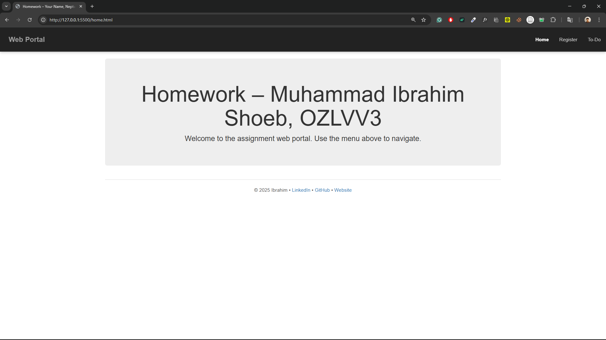
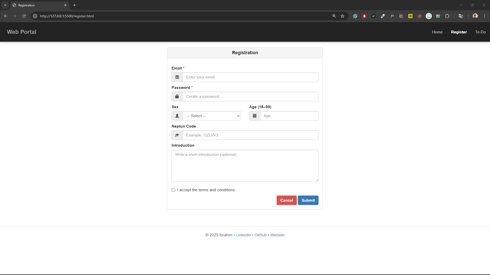
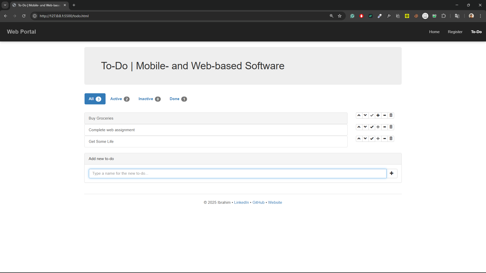

# Web Portal – Homework Assignment  
Mobile- and Web-based Software | BME

## Overview
This project implements a simple multi-page web portal as required by the homework assignment. It consists of three main pages: Home, Registration, and To-Do.
The application uses HTML, Bootstrap 3, custom CSS, and JavaScript. Functionality follows the assignment requirements without adding unnecessary features.

## Features

### Navigation
- Responsive Bootstrap navbar on all pages.
- Active page is highlighted.
- Hamburger menu appears on smaller screens.

---

## 1. Home Page
- Displays assignment title and student identification.
- Simple introduction section.
- Links to Registration and To-Do pages.

**Screenshot:**  


---

## 2. Registration Page
- Includes a Bootstrap-centered panel containing the required form fields:
  - Email  
  - Password  
  - Sex (dropdown)  
  - Age  
  - Neptun code  
  - Introduction text  
  - Acceptance checkbox
- “Cancel” redirects to the Home page.
- “Submit” sends form data to the To-Do page via GET query parameters as required.
- No backend or form processing is performed.

**Screenshot:**  


---

## 3. To-Do Page
Fully functional To-Do list implemented in JavaScript.
- Add new item  
- Mark as active / inactive / done  
- Remove item  
- Move up / move down  
- Tab filtering (All, Active, Inactive, Done)  
- Badges showing item counts  
- Persistent storage using localStorage  

**Screenshot:**  


---

## Styles
All custom styling is included in `styles.css`, including:
- Navbar formatting  
- Form layout and spacing  
- Footer layout  
- Utility classes for consistent spacing  

Bootstrap 3.3.7 is used throughout the project.

---

## Technologies Used
- HTML5  
- CSS3 + Bootstrap 3  
- JavaScript (ES5-compatible)  
- No backend required

---

## Project Structure

```
/project-folder
│
├── home.html
├── register.html
├── todo.html
├── todo.js
├── styles.css
├── README.md
├── /.vscode
│      └── launch.json
├── /Documentation
│      └── Todo_Documentation.pdf
└── /screenshots
       ├── home.png
       ├── register.png
       └── todo.png
```

---

## How to Run
1. Download or clone the repository.
2. Open `home.html` in a browser.
3. Navigate using the menu bar.
4. The portal works entirely on the client side; no server setup is required

---

## Notes
- Form submission uses GET and passes query parameters correctly.
- No crashes, no missing features.
- Code kept simple and readable for evaluation.
